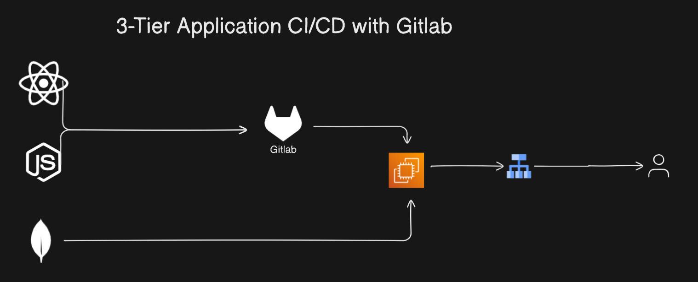

# MERN App CI/CD Deployment with GitLab, EC2, and Load Balancer

## Project Overview

This project demonstrates the end-to-end deployment pipeline of a **MERN stack application** (MongoDB, Express, React, Node.js) with **CI/CD automation** using **GitLab CI**, and **deployment on AWS EC2**. The app is deployed behind an **Application Load Balancer (ALB)** for high availability and scalability. This solution ensures continuous integration and delivery (CI/CD), secure deployment processes, and scalability, meeting modern DevOps best practices.

## Technologies Used
- **MERN Stack** (MongoDB, Express, React, Node.js)
- **GitLab CI/CD** for automation
- **AWS EC2** for hosting the application
- **AWS Application Load Balancer (ALB)** for traffic distribution
- **Docker** for containerization
- **AWS Route 53** for DNS management
- **SSL/TLS Encryption** for secure connections

## Features
- **Continuous Deployment (CD)** with GitLab CI
- **Scalable and fault-tolerant architecture** using EC2 and ALB
- **Secure deployment** with SSL/TLS and load balancing
- **Dockerized MERN app** for environment consistency

## Architecture

1. **GitLab CI**:
   - The application is hosted in a GitLab repository. Each commit triggers the pipeline for automated testing, building, and deployment.
   
2. **AWS EC2**:
   - After the application is built, it is deployed to an AWS EC2 instance using Docker containers.
   
3. **AWS ALB (Application Load Balancer)**:
   - An ALB is used to distribute incoming traffic across multiple EC2 instances for high availability.
 

 

## How to Star the Repository
If you find this project helpful, please star the repository on GitHub to show your support:
1. Click the ⭐ button in the top-right corner.

---

## Author
**Jibran**  
Passionate DevOps Engineer and Software Developer.
Connect with me on [LinkedIn](https://www.linkedin.com/in/muhammad-jibran220/).

---
 

## Feedback & Contributions
Contributions are welcome! Feel free to fork the repository and submit a pull request.

---

 